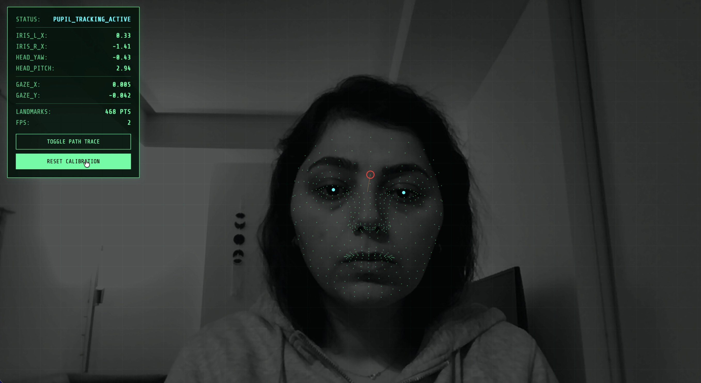

### Cranial & Oculomotor Tracking



A `threejs` / `WebGL` / `MediaPipe`-powered analytical interface designed for real-time tracking of ocular movement and cranial orientation. This project extracts precise biometric data to create a high-fidelity "Heads-Up Display" (HUD) for gaze estimation and head-pose analysis.


#### Features & Interactions

- **Oculomotor Tracking:** TSpecifically targets the iris and pupil to monitor movement within the eye socket for gaze estimation.
- **Cranial Analysis:** Calculates head Yaw and Pitch by analyzing the spatial positions of the nose relative to the ears.
- **Calibration:** Features a reset mechanism to establish a "center" baseline for mapping iris movement to screen coordinates.
- **Visual HUD:** A data panel displaying raw iris offsets, landmark status, and real-time FPS.
- **Gaze Trail:** A dynamic path trace that visualizes the movement history of the user's gaze over time.


### Setup for Development

Navigate to the project sub-folder in terminal:
```bash
cd cranial_oculomotor_tracking
```

In the terminal, type below command:
```bash
python3 -m http.server
```
Use the browser and go to:
```bash
http://localhost:8000
```
Note: Please clear your browser cache before entering the address.

### Requirements

- Modern web browser with WebGL support
- Camera access

### Technologies

- **Three.js** for 3D graphics and orthographic rendering
- **MediaPipe Face Mesh** for sub-pixel landmark detection (468 points)
- **WebGL Shaders** for GPU-accelerated graphics and custom data overlays
- **JavaScript** for real-time biometric telemetry and coordinate mapping
